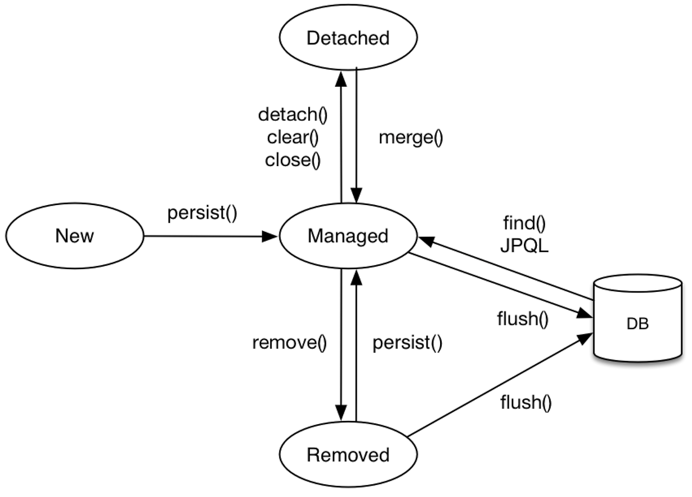

# jpa-entity-manager

## step 1

- Connection 생명주기 = 트랜잭션 생명주기 = EntityManager 생명주기
- Connection을 소유한 곳에서만 close
    - 하위 컴포넌트는 참조만 (소유 X)
    - 생성자로 의존성 전달 (Dependency Injection)

## step 2

## step 3

## memo

entity와 상태 관리

- EntityManager
    - 데이터베이스와 상호작용하면서 애플리케이션에서 엔티티 객체의 생명주기를 관리하는 역할
    - Entity의 생명주기 관리: 엔티티를 영속화(persist), 병합(merge), 삭제(remove)하는 작업을 수행
    - 데이터베이스와의 통신: 실제로 데이터베이스와의 CRUD(Create, Read, Update, Delete) 작업을 담당
    - 트랜잭션 관리: 트랜잭션 내에서 데이터베이스 작업을 처리
    - 인터페이스: EntityManager는 JPA에서 표준 인터페이스로 정의된 것이며, 구현체는 JPA 구현체(EclipseLink, Hibernate 등)에 따라 달라짐
- PersistenceContext
    - 엔티티 객체가 관리되는 메모리 공간
    - 엔티티 상태 관리: 엔티티가 영속성 컨텍스트에 들어가면 관리 상태가 되고, 그 후 변경된 내용은 자동으로 데이터베이스와 동기화
    - 1차 캐시 역할: Persistence Context는 엔티티를 메모리에 저장하므로, 동일한 트랜잭션 내에서 동일한 엔티티를 조회하면 데이터베이스에 다시 접근하지 않고 메모리에서 가져
    - 트랜잭션 스코프:Persistence Context는 트랜잭션 범위에서 관리되며, 트랜잭션이 끝나면 Persistence Context도 함께 종료됩니다. 그 후에는 엔티티가 더 이상 관리되지 않음
    - 변경 감지(Dirty Checking): 엔티티의 변경 사항을 감지하여 트랜잭션이 종료될 때 데이터베이스에 자동으로 반영
- EntityManager
    - Persistence Context를 관리
    - Persistence Context는 EntityManager 내부에서 생성되고, 엔티티는 EntityManager를 통해 이 컨텍스트에 포함
